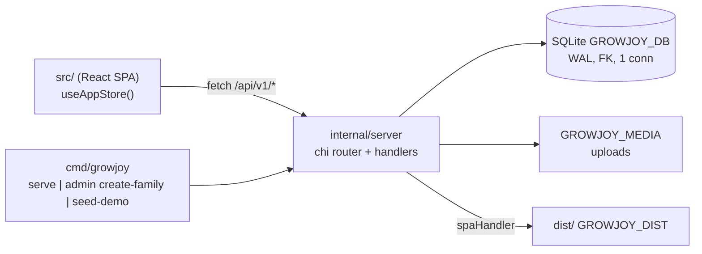

# Repository Guidelines

GrowJoy (`growjoy`): family growth-task + points-reward H5 app. One Go binary serves the JSON API, session auth, protected uploads, and a prebuilt React SPA. UI copy and `README.md` are Chinese; keep new user-facing strings Chinese.

## Project Overview

- Purpose: parents define tasks/rewards; children submit evidence, earn points, redeem wishes. Per-family multi-tenant, single process, single replica (SQLite file + media dir on one persistent volume).
- Two runtimes, one deployable: Go 1.22 chi service (`cmd/growjoy`, `internal/server`) + React 19/Vite SPA (`src/`) that the same binary serves from `dist/`.
- CI enforces the same gate list: `.github/workflows/ci.yml` runs `go` (vet + test), `web` (unit tests + `tsc -b`/Vite build) and `e2e` (Playwright flow + visual gates) on pushes to `main`, pull requests, and manual dispatch. No linter/formatter config, no Makefile/Docker — match the surrounding formatting by hand.

## Architecture & Data Flow

**Backend layout.** Exactly two non-test packages: `cmd/growjoy` (CLI only) → `internal/server` (everything else). There is no `internal/store`, no service/repository layer. `internal/server/server.go` holds config, `Open`/`applyMigrations`, the whole chi router, every handler, auth, uploads, and the DTOs; `internal/server/admin.go` holds non-HTTP operations (`CreateFamily`, `SeedDemo`, `EnsureDemo`); `internal/server/migrations/*.sql` is `//go:embed`-ed.

**Router / middleware.** `requestLog` (security headers + one access line) wraps `recoverPanic` (a handler panic becomes a logged 500 instead of a dead connection), which wraps the mux; `/health/live`, `/health/ready` sit outside the API; `r.Route("/api/v1", ...)` applies `sameOrigin`; the public auth routes (`/auth/child`, `/auth/parent`) add `s.authLimit` (per-address request brake); a nested group applies `authenticate`; role gating is `s.parentOnly(h)` or an inline actor check. No timeout middleware and no CSRF token — CSRF rests on `sameOrigin` (rejects `Sec-Fetch-Site: cross-site` or mismatched `Origin` host → 403) plus `SameSite=Lax`; because the check compares `Origin` with `r.Host`, any proxy in front MUST preserve the browser's `Host` (the Vite dev proxy sets `changeOrigin: false` for this reason).

**Data flow.** The SPA never loads resources individually: `GET /api/v1/state` returns the whole `State` aggregate (`Version: 2`: role, active child, children, tasks, submissions+attachments, wishes, ledger, redemptions). Mutations return `{"id": "..."}` (200) or 204, and `src/store.ts` then re-fetches `/state` and `/stats`. No optimistic updates — the server is the source of truth.

**Reads write.** `state()` calls `ensureInstances(ctx, family)`, which materializes `task_instances` for today (`daily`), the current ISO Monday week (`weekly`, `due_date` = Monday + `repeat_weekday`), or the creation date (`once`) using `INSERT OR IGNORE` + `UNIQUE(template_id, period_key)`. Day/week buckets are computed in the family's IANA timezone.

**Invariants to preserve (all enforced in SQL, never in app locks).**
- Every statement carries `family_id` from the session row; `RowsAffected() == 0` → 404. A query missing `AND family_id = ?` is a cross-family leak. Family-scoped reads for a child use `AND (? = 'parent' OR child_id = ?)`.
- Exactly-once effects: `point_ledger UNIQUE(family_id, reference_type, reference_id)` + `INSERT OR IGNORE`, status-guarded `UPDATE ... WHERE status IN ('todo','rejected')`, `task_instances UNIQUE(template_id, period_key)`, and `idempotency_keys PRIMARY KEY(family_id, actor_id, operation, key)`.
- `POST /tasks/{id}/submit`, `/review`, `/wishes/{id}/redeem` REQUIRE an `Idempotency-Key` header (else 400 `idempotency_required`); a replay returns the stored status with `{"replayed": true}` and MUST NOT repeat side effects.
- The pool is `SetMaxOpenConns(1)`: close each `*sql.Rows` before the next query; pragmas (`WAL`, `foreign_keys`, `busy_timeout=5000`) are applied once at `Open`, so raising the limit silently drops those guarantees.
- Internal failures NEVER reach the client: use `s.internalError(w, r, err)` (or `s.uploadError`, which keeps the `upload_failed` code) — it logs method/path/error via `s.log` and answers `{"code":"internal","message":"internal server error"}`. Never pass `err.Error()` to `problem(...)`. `/health/ready` likewise answers a bare "database unavailable".
- Auth is throttled on two independent budgets (`internal/server/ratelimit.go`): `authIP` (60 burst / 1 per second per client address, applied by `s.authLimit`) protects the process; `authFailures` (10 burst / 1 per 30 s per family) protects the parent password, the app's only credential. The failure budget is charged ONLY after a wrong password, so the family is never locked out of its own parent end — do not move that check before verification.
- The child end is the default: `POST /auth/child` opens a child session (demoting a parent session), `POST /auth/parent` unlocks with the password, and `PATCH /session/child` switches profile for both actor types. A child session mirrors its profile in `actor_id`, so the `? = 'parent' OR child_id = ?` scoping and the per-child idempotency keys stay exact. Parent authority is per visit: a reload starts the child end again and the password gate is client-side state (`Shell`'s `parentGate`) backed by the session, never a restorable parent cookie.
- Every argon2 call goes through `s.hashPassword` / `s.verifyPassword`, which serialize on a 4-slot gate (`argon2Slots`) because each call allocates 64 MiB. Direct calls to `hashSecret`/`verifySecret` bypass that bound.
- Points are double-bookkept: ledger is truth; `children.experience` is **total** experience, API exposes `experience % 100` and `level = 1 + total/100`, approval grows `max(points/5, 1)`.

**Frontend shape.** `main.tsx` → `App` → `BrowserRouter` with a catch-all route rendering `Shell`. `Shell` calls `useAppStore()` **once** and passes the whole store object down as a `store` prop; it picks child vs parent shell from `location.pathname.startsWith("/parent")` plus `state.role`, and gates on `ready`/`connected` plus a `parentGate` password modal (a `/parent` deep link is stashed and restored after unlocking). Route tables: `ChildLayout` (`/child`, `/child/tasks`, `/child/wishes`, `/child/growth`, `*` → `/child`) and `ParentLayout` (`/parent`, `/parent/children`, `/parent/tasks`, `/parent/wishes`, `/parent/stats`, `*` → `/parent`). Submitted evidence is rendered by one shared `SubmissionEvidence` (fed by `store.latestSubmissions`, the newest submission per task for the child on screen) in both the child `TaskCard` and the parent `AdminTaskRow`: images become `.media-thumb` thumbnails that open a `.media-viewer` full-screen overlay, videos become inline `.media-video` players, and any attachment without a `url` (local `File` entries before upload, `data.ts`/vitest seeds, a file the browser cannot decode) falls back to the plain `.attachment-chip` label.

## Key Directories

| Path | Purpose |
| --- | --- |
| `cmd/growjoy/main.go` | Sole `main`: subcommand dispatch (`serve`, `admin create-family`, `seed-demo`), `GROWJOY_*` env, `http.Server` + SIGINT/SIGTERM graceful shutdown. |
| `internal/server/` | Entire backend: HTTP, auth, SQLite, uploads, DTOs (`server.go`), auth throttling/argon2 gate/recovery/error helpers (`ratelimit.go`), non-HTTP operations (`admin.go`). |
| `internal/server/migrations/` | `001_init.sql` (schema of record: CHECK constraints, uniqueness keys, indexes), `002_weekday_and_experience.sql`, `003_expiry_indexes.sql`, `004_child_profiles_without_pins.sql` (drops `children.pin_hash`). Embedded at compile time. |
| `src/` | SPA: `App.tsx` (all UI), `store.ts` (state container), `types.ts` (wire shapes), `domain.ts` (pure reducers, tests only), `data.ts` (demo seed), `styles.css`. |
| `scripts/` | Node ESM verification harnesses: `with-service.mjs` (boots a throwaway real server), `flow-check.mjs`, `visual-check.mjs`. |
| `.github/workflows/ci.yml` | The only CI: `go` (vet + test), `web` (lockfile install, unit tests, build), then `e2e` (Playwright gates; uploads `.artifacts/ui` screenshots). |
| `dist/` (gitignored) | Vite output; the Go server serves it — must be rebuilt for SPA changes. |
| `data/` (gitignored) | Default `growjoy.db` + `media/`; created `0700`. Never commit. |
| `.artifacts/ui/` (gitignored) | Screenshots written by `check:ui`; visual evidence, not versioned. |

## Development Commands

| Command | Effect |
| --- | --- |
| `npm install` | Installs deps from the committed lockfile (see versioning rules below). |
| `npm run dev:server` | `go run ./cmd/growjoy serve --demo` on `127.0.0.1:8080`; idempotently creates the DEMO family. No build needed. |
| `npm run dev` | Vite dev server (`:5173`) with `/api` proxied to `127.0.0.1:8080` (`vite.config.mjs`). Run alongside `dev:server`. |
| `npm run build` | `tsc -b && vite build` → `dist/` (`tsc -b` is typecheck-only, `noEmit`). |
| `npm test` | `vitest run` over `src/domain.test.ts` only. |
| `npm run test:go` / `go test ./...` | Go tests (one package: `internal/server`). |
| `npm run check:flow` | `npm run build` then Playwright E2E against a real throwaway server: full child/parent journey with API-state assertions. |
| `npm run check:ui` | `npm run build` then 9-scenario screenshot/overflow gate → `.artifacts/ui/*.png`. |
| `npm run preview` | Static preview of `dist/` (default `:4173`). |
| `go build -o growjoy ./cmd/growjoy` | CLI binary for `admin create-family` / `seed-demo`; writes an untracked binary at the repo root (`.gitignore` has no entry for it). |

Demo credentials (`serve --demo`): family `DEMO`, parent password `growjoy2468`. The child end needs no credential and is the app's default view; `/parent` is gated by the password on every visit. Three pinning traps: the server serves whatever currently sits in `dist/` (editing `src/` requires `npm run build`; no HMR through Go), the dev proxy hardcodes port 8080 — moving `GROWJOY_ADDR` requires editing `vite.config.mjs` too, and the proxy must keep `changeOrigin: false` or every POST is rejected with `403 origin_mismatch` (`check:*` scripts are immune: ephemeral port via `BASE_URL`).

## Code Conventions & Common Patterns

### Go

- Handlers are methods registered directly in `Handler()`: `func (s *Server) verbNoun(w http.ResponseWriter, r *http.Request)`. Files are split by concern, not one file per handler.
- Dual-purpose save handlers: `chi.URLParam(r, "id") == ""` means create, otherwise update.
- JSON out: `writeJSON(w, status, v)`; errors ALWAYS via `problem(w, status, code, message)` → `{"error":{"code":"...","message":"..."}}` with snake_case codes (`invalid_request`, `invalid_credentials`, `unauthorized`, `forbidden`, `not_found`, `invalid_state`, `too_many_requests`, `idempotency_required`, `upload_too_large`, `unsupported_media`, `too_many_files`, `insufficient_points`, `wish_unavailable`, `last_child`, `conflict`, `internal`, `upload_failed`, `unavailable`) — and internal ones through `s.internalError`/`s.uploadError`, never with the raw error text.
- JSON in: `decode(r, v)` — 1 MiB `io.LimitReader` **and** `DisallowUnknownFields()`; a client field absent from the Go input struct is a 400. Multipart submit reads `r.FormValue("note")` instead.
- Raw inline SQL with `?` placeholders. No ORM, no repository layer, no prepared statements. Scan into the exported DTOs (`Child`, `Task`, `Submission`, `Wish`, `Ledger`, `Redemption`, `State`) — camelCase `json` tags over snake_case columns; request bodies use unexported per-resource types (`childInput`, `taskInput`, `wishInput`) or inline anonymous structs.
- Multi-write flows use `tx, err := s.db.BeginTx(ctx, nil)` + `defer tx.Rollback()` + explicit `Commit()` (`CreateFamily`, `SeedDemo`, `deleteChild`, `deleteTask`, `submitTask`, `reviewTask`, `redeemWish`). Never touch `s.db` after `Commit()` in the same handler.
- Time: read `s.now()` — NEVER `time.Now()` in a handler, and never the process-local zone for day/week math (`familyLocation(ctx, family)` instead). Persisted instants are `nowText(t)` = UTC `RFC3339Nano`; date-only values (`due_date`, `period_key`) are family-local `2006-01-02`. Note `RFC3339Nano` trims trailing zeros, so lexicographic ordering within the same second is unreliable.
- IDs: `id(prefix)` = `prefix + "_" + 16 random bytes hex`. Prefixes in use: `fam par child ses tpl task sub att media wish red led`. No UUIDs in Go (`google/uuid` is indirect and unused).
- Auth: argon2id PHC hashes (`hashSecret`/`verifySecret`, cost re-parsed from the stored string) reached through the gated `s.hashPassword`/`s.verifyPassword`; sessions persist only `tokenHash(raw)` = sha256 hex; cookie `growjoy_session` (`HttpOnly`, `SameSite=Lax`, `Secure=GROWJOY_SECURE_COOKIES`), 30d for the child end and 12h for a parent session (which a reload replaces anyway). Parents may have several rows: `POST /auth/parent` verifies the submitted password against each of the family's parents in creation order and binds the session to the match. No session GC on the request path — `s.Sweep(ctx)` deletes expired sessions and idempotency keys older than `idempotencyRetention` (30d), is called on boot and hourly by `serve`, and also evicts idle limiter buckets.
- The served family is resolved, never requested: `s.resolvedFamily` takes the oldest `families` row, and `POST /auth/child` answers 409 `no_family` when the database has none. `s.firstChild` / `s.familyChild` back the default child selection, so a session's profile always belongs to the served family.
- Credential budgets are keyed per family via `authFailureKey(code, "parent")`, where the code comes from the resolved row, so client input cannot mint unbounded buckets. Only the parent password is a credential, so only `/auth/parent` charges it.
- Uploads (`submitTask` only): `http.MaxBytesReader` 101 MiB, `ParseMultipartForm(100 MiB)`, `defer RemoveAll()`, field `files`, ≤6 files, ≤100 MiB total. `inspectUpload` sniffs 512 bytes plus MP4/WebM probes; allow-list jpeg/png/webp ≤10 MiB, mp4/webm ≤100 MiB. Files land in `MediaDir` as `media_<hex><ext>` with `O_CREATE|O_EXCL|O_WRONLY, 0600`, with a cleanup closure that removes written files if a later step fails. Serving is session-authenticated, family-scoped, `Content-Disposition: inline`, `http.ServeContent` for ranges.
- Migrations: `001_init.sql` re-runs on EVERY boot and therefore MUST stay idempotent (`IF NOT EXISTS` / `INSERT OR IGNORE`); versions > 1 run once inside a transaction. Never edit an already-applied file — add the next `NNN_*.sql`. Filenames must be `NNN_name.sql` with an integer prefix parseable by `strconv.Atoi`.
- Internal failures are logged and answered generically through `s.internalError` / `s.uploadError` (see the invariants list above); `s.shed` answers 503 `unavailable` when the hash gate is saturated and the request gives up waiting.
- `spaHandler` returns `index.html` with 200 for any unknown path — including `/favicon.ico` (no favicon exists). Broken asset references fail silently instead of 404ing.

### TypeScript / React

- `src/App.tsx` (≈2200 lines) intentionally holds every component plus module-level constants, colocated PascalCase `function` declarations. Put new UI here rather than creating per-feature files; match the existing flat structure.
- All application state lives in `useAppStore()` (`src/store.ts`) and is passed down as a `store` prop. No context, no Redux/Zustand, no per-page fetching. Add queries as `actions` entries on the returned object and mutate through `run(() => ...)`, which refreshes server state. The store boot calls `POST /auth/child` (that is the app's default view), and `request()` re-opens the child end and replays the call once when a non-auth route answers 401.
- Requests go through the module-private `request()` helper hitting `/api/v1${path}`; write helpers come from `json(method, value, idempotent)` — pass `idempotent = true` for submit/review/redeem (it attaches a `crypto.randomUUID()` `Idempotency-Key`).
- `src/domain.ts` holds pure `AppState` reducers (`submitTask`, `reviewTask`, `saveChild`, `saveTask`, `saveWish`, `redeemWish`, …) with an injectable `DomainClock`. They are exercised only by tests — the running UI relies on the server.
- `src/types.ts` mirrors the Go DTO wire shapes; change it together with the Go structs and `State.Version`.
- Styling is one file, `src/styles.css`, in minified single-line-rule style, with hand-written class names (`child-home`, `task-card`, `parent-layout`, `.bottom-nav`, `.pin-modal`, `.admin-row`), a few `:root` custom properties, and 760px / 430px breakpoints. Append new rules in the same compact style; there is no CSS-in-JS, Tailwind, or CSS modules.
- Mobile-first, Chinese-only copy inline (no i18n layer), `lucide-react` icons, `index.html` is `lang="zh-CN"`.
- TypeScript is `strict` with `allowJs: false` — `.ts`/`.tsx` only under `src/`; `scripts/*.mjs` and `vite.config.mjs` are plain ESM JavaScript outside the TS program.

## Important Files

| File | Why it matters |
| --- | --- |
| `internal/server/server.go` | `Open`/`applyMigrations`, `Handler` (full route map), `state`/`ensureInstances`/`streaks`/`stats`, `submitTask`/`reviewTask`/`redeemWish` (the pattern to copy for any new mutation), `media`/`inspectUpload`, the auth entry points (`childSession`/`parentSession`/`selectChild`/`lookupSession`, `resolvedFamily`), DTOs. |
| `internal/server/admin.go` | `CreateFamily`, `SeedDemo` (idempotent; seeds 米娅/乐乐, 5 tasks, 4 wishes), `EnsureDemo`, `FamilyInput`. |
| `internal/server/ratelimit.go` | Token-bucket limiters, credential-failure budgets, argon2 slot gate, `recoverPanic`/`responseTracker`, and the `internalError`/`uploadError`/`shed`/`hashFailure` helpers. Tune the constants here. |
| `internal/server/migrations/001_init.sql` | Schema of record — CHECK constraints and the uniqueness keys that make concurrency safe. |
| `internal/server/server_test.go` | Only Go test file; its helpers are the templates for new tests. |
| `cmd/growjoy/main.go` | Only place reading `GROWJOY_*`; add new config here plus a `server.Config` field. |
| `src/store.ts` | The single state container and API client; boots the default child end (`POST /auth/child`) and replays one request after a lost session. |
| `src/App.tsx` | Every screen, route table, and form. |
| `src/domain.ts`, `src/types.ts`, `src/data.ts` | Pure reducers + clock, wire types, demo seed (also the vitest fixture). |
| `scripts/with-service.mjs` | Builds the binary, allocates a free port, boots `serve --demo` with temp DB/media, polls `/health/ready`, exports `BASE_URL`, then SIGTERMs and deletes the temp dir. It does NOT build the frontend. |
| `scripts/flow-check.mjs` / `scripts/visual-check.mjs` | Behavioral E2E and visual/overflow gates; both depend on demo data, Chinese accessible names, and CSS class hooks. |

## Runtime/Tooling Preferences

- **Go 1.22+**, module `growjoy` (imports are `growjoy/internal/server`). Deps pinned exactly in `go.mod`/`go.sum`: chi v5.2.1, `golang.org/x/crypto` v0.33.0, pure-Go `modernc.org/sqlite` v1.36.1 (no cgo, no `CGO_ENABLED` gymnastics). Version changes only via `go get <mod>@<ver>` + `go mod tidy`; never hand-edit `go.sum` or "tidy" indirect pins.
- **Node ≥ 22.13** in practice (lockfile engine floors: jsdom 30 `^22.13.0 || >=24`, vitest 5 `^22.12.0 || ^24 || >=26`, vite 8 `^20.19 || >=22.12`) even though `README.md` says Node 20+. Repo is ESM (`"type": "module"`); tooling is `.mjs`.
- **Versioning posture:** every `package.json` dependency is declared `"latest"` except `playwright: ^1.63.0`; the committed lockfile (v3) is the only pin. Do NOT run bare `npm install`/`npm update` as a side effect of unrelated work — it can promote majors. Change versions with `npm install <pkg>` and commit the lockfile.
- Config surface: `vite.config.mjs` (react plugin + `/api` proxy only — no vitest config, so `npm test` runs in the default `node` environment and the installed `jsdom` is never selected); `tsconfig.json` is a solution file (`files: []` + reference) so `tsc -b` builds only `tsconfig.app.json`.
- Playwright is the bare `playwright` package used as a library (`chromium.launch`), not `@playwright/test`; browsers must be installed out of band or both `check:*` scripts fail after the frontend build.
- Env vars (read only in `cmd/growjoy/main.go`): `GROWJOY_ADDR` (default `127.0.0.1:8080`), `GROWJOY_DB` (`data/growjoy.db`), `GROWJOY_MEDIA` (`data/media`), `GROWJOY_DIST` (`dist`), `GROWJOY_SECURE_COOKIES` (`false`; must be exactly `"true"` behind TLS). Health: `GET /health/live`, `GET /health/ready`. Deploy single-process/single-replica; DB and media must be backed up as one consistent unit. `serve` sweeps expired sessions and stale idempotency keys on boot and hourly (`sweepInterval`), so no external cron is needed; auth throttling state is in-memory and resets on restart.
- Committed artifacts that matter: `package-lock.json`, `go.sum`, `go.mod`, `vite.config.mjs`, `tsconfig*.json`, `index.html`. Ignored/generated: `node_modules/`, `dist/`, `*.tsbuildinfo`, `.vite/`, `coverage/`, `.vitest/`, `.artifacts/`, `data/`. Never commit `data/growjoy.db` or uploaded media.

## Testing & QA

**Go — `go test ./...` (or `npm run test:go`).** Single test file `internal/server/server_test.go`: 12 tests, 7 helpers, stdlib `testing` only (no testify/sqlmock — real SQLite file per test in `t.TempDir()`), white-box `package server`, driven through `s.Handler()` + `httptest.NewRecorder()` (no listener, no ports).

- Reuse the existing helpers instead of new scaffolding: `testServer(t)` (temp dir + `Open` with a discard `slog` handler + `t.Cleanup(s.Close)` + DEMO family + `SeedDemo`), `doJSON`, `parentCookie`, `childCookie` (starts the default child end and points it at a profile), `sessionFor` (writes a session row directly, the only way to act as a family the app does not serve), `getStateTest`, `multipartRequest`.
- Hardening coverage to extend rather than duplicate: `TestChildEndIsTheDefaultAndThePasswordGatesTheManagementApi` (the whole contract: no cookie still gets the child end, management routes answer 403, a wrong password 401, unlocking replaces the session, leaving the parent end demotes it), `TestParentPasswordBudgetThrottlesGuessingWithoutLockingOutTheFamily` (10 wrong passwords then 429, correct password still 200), `TestChildEndWithoutAFamilyIsRefused` (409 `no_family`), `TestSaturatedHashGateShedsLoad` (503 + no session), `TestSweepReclaimsExpiredSessionsAndStaleKeys`, `TestInternalErrorsAreLoggedNotLeakedAndPanicsAreRecovered` (asserts the client body never carries the underlying error while the logger does; use a `bytes.Buffer` slog handler).
- Conventions: no subtests, no table-driven cases, no `t.Parallel`, no `t.Log`; helpers call `t.Helper()`; failures are `t.Fatal(err)` or `t.Fatalf("<what>: %d %s", w.Code, w.Body.String())` so the HTTP body is in the output. Long compound names encode multiple rules (`TestReviewCreditsExactlyOnceUsesMinimumGrowthAndRedemptionCannotOverdraw`); extend the test that already guards a rule rather than adding a near-duplicate.
- Force time with `s.now = func() time.Time { ... }` before the request and seed date-sensitive rows with `nowText(s.now())`; seeded demo data otherwise uses wall-clock time and scheduling assertions drift.
- The restart test derives its expected `schema_migrations` count from `migrationFS.ReadDir("migrations")`, so adding a migration does not require editing it — keep it that way.
- Never point tests at `Config{}` (it resolves to the real `data/growjoy.db`). Give every logically distinct operation its own `Idempotency-Key`; reuse a key only to assert replay behavior.
- Single test / package: `go test ./internal/server/ -run TestFamilyTimezoneWeeklyScheduleAndConsecutiveStreak -v`. `-race` is valid (pure-Go sqlite) but unused in the repo.
- Covered: migrations applied once across restart, cross-origin rejection, timezone-aware weekly/daily scheduling + streaks, upload content sniffing, concurrent-submit idempotency, exactly-once review credit + minimum growth, redemption overdraw guard, family isolation, last-child protection, the default child end + parent password gate, the `no_family` start-up state. Untested: the CLI, health endpoints, `spaHandler`, most CRUD handlers, media download, stats.

**Frontend — `npm test`.** `vitest run` over `src/domain.test.ts` only (pure reducers over `seedState` + `DomainClock`). No vitest config file, no DOM tests, no coverage config.

**End-to-end — `npm run check:flow` and `npm run check:ui`.** Both rebuild `dist/` and wrap Playwright in `scripts/with-service.mjs`, which `go build`s the binary, allocates an ephemeral port, runs `serve --demo` against a temp DB/media with the repo's real `dist/`, polls `/health/ready` (100 × 100 ms), then SIGTERMs and `rm -rf`s. `flow-check.mjs` (390×844, headless) walks the real journey — the child end booting without a credential, evidence upload (a real canvas-generated PNG plus a fake MP4, then a decoded-pixel assertion on the served bytes, the `.media-thumb` → `.media-viewer` overlay, and `.artifacts/ui/evidence-{child,parent}.png`), parent unlock, approve/reject/resubmit, profile switching, redeem, persistence after reload, child CRUD — and asserts server state via `page.evaluate(fetch('/api/v1/state'))`; any console/page error fails the run except a whitelisted `401 (Unauthorized)`. `visual-check.mjs` runs 9 viewport/route scenarios, writes full-page PNGs to `.artifacts/ui/`, and fails (via `process.exitCode = 1`) on console errors, horizontal overflow (`bodyWidth > viewportWidth + 1`), `textLength < 20`, or `bodyHeight < height / 2`; it reaches a parent route by unlocking and then clicking the sidebar link, because a reload would fall back to the child end. Both harnesses hard-code demo data (which is why `SeedDemo` stamps every seeded row with its own creation time), Chinese accessible names (`完成任务`, `保存修改`, `确认删除`, `家长密码`), and CSS class hooks (`.task-card`, `.bottom-nav`, `.parent-layout`, `.pin-modal`, `.media-thumb`, `.media-video`, `.media-viewer`, …): renaming any of those requires updating the scripts in the same change.

**Coverage expectations:** no coverage tooling and no threshold is declared; correctness rests on the gate list (`go test ./...` → `npm test` → `npm run build` → `npm run check:flow` → `npm run check:ui`), which `.github/workflows/ci.yml` runs on every push to `main` and every pull request. For backend behavior changes, add or extend a `server_test.go` case, and for UI changes run `check:flow`/`check:ui` rather than inventing new test files. The Playwright harnesses now log in twice per run (once per parent scenario in `check:ui`), and only *failed* passwords consume the family budget — a 429 there means the throttle regressed, not that the harness needs loosening.
