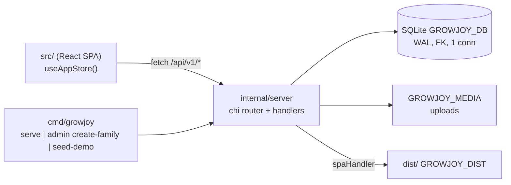

# Repository Guidelines

GrowJoy (`growjoy`): a family growth-task + points-reward H5 app. One Go binary serves the JSON API, session auth, protected uploads, and a prebuilt React SPA. UI copy, demo data and `README.md` are Chinese — write new user-facing strings in Chinese.

## Project Overview

- Purpose: parents define tasks/rewards; children submit evidence, earn points, redeem wishes. Per-family multi-tenant, single process, single replica (one SQLite file + one media dir on one persistent volume).
- Two runtimes, one deployable: Go 1.22 chi service (`cmd/growjoy`, `internal/server`) + React 19/Vite SPA (`src/`) that the same binary serves from `dist/`.
- The served family is never requested by the client: `resolvedFamily` takes the oldest `families` row, so the app is single-family in practice. `POST /auth/child` answers 409 `no_family` when the database has no family.
- Gate list enforced by CI (`.github/workflows/ci.yml`, push to `main` / every PR / manual): `go vet ./...` + `go test ./...` → `npm ci` + `npm test` + `npm run build` → `npm run check:flow` + `npm run check:ui`. No linter, formatter, Makefile or Dockerfile exists — match surrounding formatting by hand.

## Architecture & Data Flow

**Backend layout.** Exactly two non-test packages: `cmd/growjoy` (CLI only) → `internal/server` (everything else). There is no `internal/store`, no service/repository layer. `server.go` holds `Config`/`Server`, `Open`/`applyMigrations`, the whole chi router, every handler, auth, uploads and the DTOs; `admin.go` holds non-HTTP operations (`CreateFamily`, `SeedDemo`, `EnsureDemo`); `ratelimit.go` holds the token buckets, the argon2 slot gate, `recoverPanic` and the error helpers; `migrations/*.sql` is `//go:embed`-ed.

**Middleware chain.** `requestLog` (security headers `nosniff`/`DENY`/`same-origin`, then one access line) wraps `recoverPanic` (a handler panic becomes a logged 500, and a response already written is not rewritten) wraps the mux. `/health/live`, `/health/ready` sit outside the API; `r.Route("/api/v1", ...)` applies `sameOrigin`; the public auth routes add `s.authLimit`; a nested group applies `authenticate`; role gating is `s.parentOnly(h)` or an inline actor check. No timeout middleware, no CSRF token, no CORS headers, no `Cache-Control`: CSRF rests on `sameOrigin` (GET/HEAD/OPTIONS pass; `Sec-Fetch-Site: cross-site` → 403 `cross_site_request`; a non-empty `Origin` whose host != `r.Host` → 403 `origin_mismatch`) plus `SameSite=Lax`. The check compares `Origin` with `r.Host`, so any proxy in front MUST preserve the browser's `Host` — this is why the Vite dev proxy sets `changeOrigin: false`.

**Routes** (`server.go:244-290`; `+auth` = `authenticate`, `+parent` = `parentOnly`, both after `+sameOrigin`):

| Route | Middleware | Actor | Success | Notable failures |
|---|---|---|---|---|
| `GET /health/live`, `GET /health/ready` | requestLog, recoverPanic | none | 200 `{"status":"ok"}` | ready: 503 `unavailable` `"database unavailable"` |
| `POST /api/v1/auth/child` | +authLimit | none | 200 `{role,activeChildId}` | 409 `no_family`, 429 `too_many_requests` |
| `POST /api/v1/auth/parent` | +authLimit | none | 200 `{role:"parent",activeChildId}` | 400 `invalid_request`, 401 `invalid_credentials`, 429, 503 |
| `GET /api/v1/state` | +auth | any | 200 full `State` | 401 `unauthorized` |
| `PATCH /api/v1/session/child` | +auth | any | 204 | 400, 404 |
| `POST /api/v1/children/`, `PUT/DELETE /api/v1/children/{id}` | +auth +parent | parent | 200 `{id}` / 204 | 400, 404, 409 `last_child` |
| `POST /api/v1/tasks/`, `PUT/DELETE /api/v1/tasks/{id}` | +auth +parent | parent | 200 `{id}` / 204 | 400, 404 |
| `POST /api/v1/tasks/{id}/submit` | +auth | **child only** | 200 `{id}` | 403, 409 `invalid_state`/`conflict`, 413 `upload_too_large`, 415 `unsupported_media`, 400 `too_many_files`/`idempotency_required` |
| `POST /api/v1/tasks/{id}/review` | +auth +parent | parent | 200 `{approved}` | 400 `idempotency_required`, 409 `invalid_state` |
| `POST /api/v1/wishes/`, `PUT/DELETE /api/v1/wishes/{id}` | +auth +parent | parent | 200 `{id}` / 204 | 400, 404 |
| `POST /api/v1/wishes/{id}/redeem` | +auth | **child only** | 200 `{id}` | 403, 400 `idempotency_required`, 409 `wish_unavailable`/`insufficient_points` |
| `GET /api/v1/media/{id}` | +auth | any | bytes, `Content-Disposition: inline`, ranges via `http.ServeContent` | 404 `not_found` |
| `GET /api/v1/stats` | +auth | any | 200 stats | 401 |
| `*` | requestLog, recoverPanic | none | existing file, else `index.html` 200 | never 404 (includes `/favicon.ico`) |

`submit`/`redeem` reject a parent actor (`403 forbidden "child access required"`) and `review` is registered `parentOnly`, so a session can never do both. The three create routes are subrouter `/` routes: `src/store.ts` always emits the trailing-slash form.

**Data flow.** The SPA never loads resources individually: `GET /api/v1/state` returns the whole `State` aggregate (role, active child, children, tasks, submissions+attachments, wishes, ledger, redemptions) and `/stats` a separate payload. Mutations return `{"id":"..."}` (200) or 204, and `src/store.ts` re-fetches both. No optimistic updates — the server is the source of truth. `State.Version` is hard-coded `2` server-side and read by nobody (the SPA ignores it; `src/data.ts` still seeds `version: 1`).

**Reads write.** `state()` calls `ensureInstances(ctx, family)`, which materializes `task_instances` for today (`daily`), the current ISO Monday week (`weekly`, `due_date` = Monday + `(repeat_weekday+6)%7` days, `period_key` = Monday) or the creation date (`once`, `period_key = "once"`) with `INSERT OR IGNORE` + `UNIQUE(template_id, period_key)`. Day/week buckets use the family's IANA timezone (`Asia/Shanghai` default). `state()` output order is a UI contract: children/ledger/redemptions/submissions ascending, tasks and wishes `created_at DESC`, every slice normalized to a non-nil array.

**Invariants to preserve (all enforced in SQL, never in app locks).**
- Every statement carries `family_id` from the session row; `RowsAffected() == 0` → 404. A query missing `AND family_id = ?` is a cross-family leak. Child-scoped reads use the literal `AND (? = 'parent' OR child_id = ?)` bound to the actor type + selected child.
- Exactly-once effects: `point_ledger UNIQUE(family_id, reference_type, reference_id)` + `INSERT OR IGNORE` with a `RowsAffected()==1` guard before crediting growth, status-guarded `UPDATE ... WHERE status IN ('todo','rejected')` (`changed != 1` → 409 `conflict`), `task_instances UNIQUE(template_id, period_key)`, `INSERT OR IGNORE` keys, and `idempotency_keys PRIMARY KEY(family_id, actor_id, operation, key)`.
- `POST /tasks/{id}/submit`, `/review`, `/wishes/{id}/redeem` REQUIRE an `Idempotency-Key` header (else 400 `idempotency_required`); a replay returns the stored status with `{"replayed": true}` and MUST NOT repeat side effects. The live key row is inserted inside the same transaction as the effects; `status_code` is the only column ever read back (`response_body` is write-only).
- The pool is `SetMaxOpenConns(1)`: close each `*sql.Rows` before the next query. Pragmas (`WAL`, `foreign_keys=ON`, `busy_timeout=5000`) are applied once at `Open` on that single connection, so raising the limit silently drops all three — `deleteChild`'s `ON DELETE CASCADE` depends on `foreign_keys`.
- Internal failures NEVER reach the client: use `s.internalError(w, r, err)` (or `s.uploadError`, which keeps the `upload_failed` code) — it logs method/path/error via `s.log` and answers `{"error":{"code":"internal","message":"internal server error"}}`. Never pass `err.Error()` to `problem(...)`. `/health/ready` likewise answers a bare "database unavailable".
- Auth is throttled on two independent budgets (`ratelimit.go:26-33`): `authIP` (60 burst / 1 per second per client address, applied by `s.authLimit`) protects the process; `authFailures` (10 burst / 1 per 30 s per family actor) protects the parent password, the app's only credential. The failure budget is charged ONLY after a wrong password (check → charge → 401), so the family is never locked out of its own parent end — do not move that check before verification. `clientAddr` deliberately ignores `X-Forwarded-For`; buckets are evicted only by `Sweep` (idle > 30 min).
- The child end is the default: `POST /auth/child` opens (or reuses) a child session, demoting a parent session by deleting its row; `POST /auth/parent` verifies the submitted password against each of the family's parents in `created_at,id` order and binds the session to the match; `PATCH /session/child` switches profile for both actor types and, for a child session, rewrites `actor_id=selected_child_id`. A child session mirrors its profile in `actor_id`, so the scoping form and the per-child idempotency keys stay exact. Parent authority is per visit: a reload starts the child end again and the password gate is client-side state (`Shell`'s `parentGate`) backed by a 12 h parent session (child sessions last 30 d).
- Every argon2 call goes through `s.hashPassword` / `s.verifyPassword`, which serialize on a 4-slot gate (`argon2Slots`) because each call allocates 64 MiB. Direct calls to `hashSecret`/`verifySecret` bypass that bound.
- Points are double-bookkept: ledger is truth; `children.experience` is **total** experience, the API exposes `experience % 100` and `level = 1 + total/100`, approval adds `max(points/5, 1)` and recomputes the level from the new total. `children.points_balance` has `CHECK(points_balance>=0)`.

**Frontend shape.** `main.tsx` → `App` → `BrowserRouter` with a catch-all route rendering `Shell`. `Shell` calls `useAppStore()` **once** and passes the whole store object down as a `store` prop; it picks child vs parent shell from `location.pathname.startsWith("/parent")` plus `state.role`, and gates on `ready`/`connected` plus a `parentGate` password modal (a `/parent` deep link is stashed and restored after unlocking). Route tables: `ChildLayout` (`/child`, `/child/tasks`, `/child/wishes`, `/child/growth`, `*` → `/child`) and `ParentLayout` (`/parent`, `/parent/children`, `/parent/tasks`, `/parent/wishes`, `/parent/stats`, `*` → `/parent`). Submitted evidence is rendered by one shared `SubmissionEvidence` (fed by `store.latestSubmissions`, the newest submission per task for the child on screen) in both the child `TaskCard` and the parent `AdminTaskRow`: images become `.media-thumb` thumbnails that open a `.media-viewer` overlay, videos become inline `.media-video` players, and any attachment without a `url` (local `File` entries before upload, `data.ts`/vitest seeds, a file the browser cannot decode) falls back to the plain `.attachment-chip` label.

**Server-side analytics.** `GET /stats` is computed for `x.SelectedChildID` only — it is not a family aggregate — over a 7-day window (`totalTasks` instances with `template_id IS NOT NULL`, `completedTasks` submissions `approved=1` reviewed inside it, ledger sums, exactly 7 `daily` entries labelled `周日..周六`, and a fixed 3-name `categories` list `["生活自理","家庭责任","学习成长"]`). The child `Growth` screen does NOT consume it: its 7-bar chart is hard-coded data (`src/App.tsx` ~853). Only `ParentStats` uses the real payload.

## Key Directories

|Path|Purpose|
|---|---|
|`cmd/growjoy/main.go`|Sole `main`: subcommand dispatch (`serve`, `admin create-family`, `seed-demo`), the only reader of `GROWJOY_*`, `http.Server{ReadHeaderTimeout: 10s}` + SIGINT/SIGTERM graceful shutdown, hourly `Sweep` ticker.|
|`internal/server/`|Entire backend: HTTP, auth, SQLite, uploads, DTOs (`server.go`), auth throttling/argon2 gate/panic recovery/error helpers (`ratelimit.go`), non-HTTP operations (`admin.go`).|
|`internal/server/migrations/`|`001_init.sql` (schema of record: 13 tables, CHECK constraints, uniqueness keys, indexes), `002_weekday_and_experience.sql`, `003_expiry_indexes.sql`, `004_child_profiles_without_pins.sql` (drops `children.pin_hash`). Embedded at compile time.|
|`src/`|SPA: `App.tsx` (all UI, 2151 lines), `store.ts` (state container + API client), `types.ts` (wire shapes), `domain.ts` (pure reducers, tests only), `data.ts` (demo seed), `styles.css` (32 minified lines).|
|`scripts/`|Node ESM verification harnesses: `with-service.mjs` (boots a throwaway real server), `flow-check.mjs`, `visual-check.mjs`.|
|`.github/workflows/ci.yml`|The only CI: `go` (vet + test), `web` (lockfile install, unit tests, build), then `e2e` (`needs: [go, web]`; Chromium install, both Playwright gates; uploads `.artifacts/ui` as `ui-screenshots` with `if: always()`).|
|`dist/` (gitignored)|Vite output; the Go server serves it — must be rebuilt for SPA changes.|
|`data/` (gitignored)|Default `growjoy.db` + `media/`; created `0700`. Never commit.|
|`.artifacts/` (gitignored)|`ui/*.png` from **both** Playwright gates (`check:ui` writes 9 scenario PNGs, `check:flow` writes `evidence-child.png`/`evidence-parent.png`); visual evidence, not versioned.|

## Development Commands

|Command|Effect|
|---|---|
|`npm install`|Installs deps from the committed lockfile (see versioning rules below). CI uses `npm ci`.|
|`npm run dev:server`|`go run ./cmd/growjoy serve --demo` on `127.0.0.1:8080`; idempotently creates the DEMO family. No build needed.|
|`npm run dev`|Vite dev server (`:5173`) with `/api` proxied to `127.0.0.1:8080` (`vite.config.mjs`). Run alongside `dev:server`.|
|`npm run build`|`tsc -b && vite build` → `dist/` (`tsc -b` is typecheck-only: `noEmit`).|
|`npm test`|`vitest run` over `src/domain.test.ts` only (11 tests).|
|`npm run test:go` / `go test ./...`|Go tests (one package: `internal/server`).|
|`npm run check:flow`|`npm run build` then Playwright E2E against a real throwaway server: full child/parent journey with API-state assertions.|
|`npm run check:ui`|`npm run build` then 9-scenario screenshot/overflow gate → `.artifacts/ui/*.png`.|
|`npm run preview`|Static preview of `dist/` (default `:4173`); serves no `/api` proxy, so the harnesses cannot pass against it.|
|`go build -o growjoy ./cmd/growjoy`|CLI binary for `admin create-family` / `seed-demo`; writes an untracked binary at the repo root (`.gitignore` has no entry for it).|

Demo credentials (`serve --demo`): family `DEMO`, parent password `growjoy2468`. The child end needs no credential and is the app's default view; `/parent` is gated by the password on every visit. Three pinning traps: the server serves whatever currently sits in `dist/` (editing `src/` requires `npm run build`; no HMR through Go), the dev proxy hardcodes port 8080 — moving `GROWJOY_ADDR` requires editing `vite.config.mjs` too, and the proxy must keep `changeOrigin: false` or every POST is rejected with `403 origin_mismatch` (`check:*` scripts are immune: ephemeral port via `BASE_URL`).

## Code Conventions & Common Patterns

### Go

- Handlers are methods registered directly in `Handler()`: `func (s *Server) verbNoun(w http.ResponseWriter, r *http.Request)`. Files are split by concern, not one file per handler.
- Dual-purpose save handlers: `chi.URLParam(r, "id") == ""` means create, otherwise update (`saveChild`, `saveTask`, `saveWish`).
- JSON out: `writeJSON(w, status, v)`; errors ALWAYS via `problem(w, status, code, message)` → `{"error":{"code":"...","message":"..."}}` with snake_case codes — in use: `invalid_request`, `invalid_credentials`, `unauthorized`, `forbidden`, `not_found`, `invalid_state`, `too_many_requests`, `idempotency_required`, `upload_too_large`, `unsupported_media`, `too_many_files`, `insufficient_points`, `wish_unavailable`, `last_child`, `conflict`, `internal`, `upload_failed`, `unavailable`, `no_family`, `origin_mismatch`, `cross_site_request` — and internal ones through `s.internalError`/`s.uploadError`, never with the raw error text.
- JSON in: `decode(r, v)` — 1 MiB `io.LimitReader` **and** `DisallowUnknownFields()`; a client field absent from the Go input struct is a hard 400. Multipart submit reads `r.FormValue("note")` instead.
- Raw inline SQL with `?` placeholders. No ORM, no repository layer, no prepared statements. Scan into the exported DTOs (`Child`, `Task`, `Submission`, `Wish`, `Ledger`, `Redemption`, `State`) — camelCase `json` tags over snake_case columns; request bodies use unexported per-resource types (`childInput`, `taskInput`, `wishInput`) or inline anonymous structs.
- Multi-write flows use `tx, err := s.db.BeginTx(ctx, nil)` + `defer tx.Rollback()` + explicit `Commit()` — the exact set is `CreateFamily`, `SeedDemo`, `deleteChild`, `deleteTask`, `submitTask`, `reviewTask`, `redeemWish`. Never touch `s.db` after `Commit()` in the same handler.
- Time: read `s.now()` — NEVER `time.Now()` in a handler, and never the process-local zone for day/week math (`familyLocation(ctx, family)` instead). Persisted instants are `nowText(t)` = UTC `RFC3339Nano`; date-only values (`due_date`, `period_key`) are family-local `2006-01-02`. Note `RFC3339Nano` trims trailing zeros, so lexicographic ordering within the same second is unreliable.
- IDs: `id(prefix)` = `prefix + "_" + 16 random bytes hex`. Prefixes in use: `fam par child ses tpl task sub att media wish red led`. No UUIDs in Go (`google/uuid` is indirect and unused).
- Auth: argon2id PHC hashes (`hashSecret`/`verifySecret`, cost re-parsed from the stored string) reached through the gated `s.hashPassword`/`s.verifyPassword`; sessions persist only `tokenHash(raw)` = sha256 hex; cookie `growjoy_session` (`Path=/`, `HttpOnly`, `SameSite=Lax`, `Secure=GROWJOY_SECURE_COOKIES`, `Expires`, no `Max-Age`/`Domain`), 30 d for the child end and 12 h for a parent session (which a reload replaces anyway). `CreateFamily` requires a code/name/username and `len(password) >= 8`, and validates the IANA timezone. No session GC on the request path — `s.Sweep(ctx)` deletes expired sessions and idempotency keys older than `idempotencyRetention` (30 d), evicts idle limiter buckets, is called on boot and hourly by `serve`.
- Credential budgets are keyed per family via `authFailureKey(code, "parent")` (`UPPER(TRIM(code)) + ":parent"`), where the code comes from the resolved row, so client input cannot mint unbounded buckets. Only the parent password is a credential, so only `/auth/parent` charges it.
- Uploads (`submitTask` only): `http.MaxBytesReader` 101 MiB, `ParseMultipartForm(100 MiB)`, `defer RemoveAll()`, field `files`, ≤6 files, ≤100 MiB total. `inspectUpload` sniffs 512 bytes plus MP4 (`ftyp` + brand) / WebM (EBML + `webm`) probes; allow-list jpeg/png/webp ≤10 MiB, mp4/webm ≤100 MiB. A non-multipart body is reported as 413 `upload_too_large`, not 415. Files land in `MediaDir` as `media_<hex><ext>` with `O_CREATE|O_EXCL|O_WRONLY, 0600`, written **before** the transaction, with a cleanup closure that removes written files if a later step fails (never after a successful commit). Serving is session-authenticated and family-scoped, `filepath.Base` guards traversal, `http.ServeContent` handles ranges.
- Migrations: `001_init.sql` re-runs on EVERY boot outside any transaction and therefore MUST stay idempotent (`IF NOT EXISTS` / `INSERT OR IGNORE`; it self-inserts `schema_migrations` version 1, which `applyMigrations` skips recording); versions > 1 run once inside a transaction. Never edit an already-applied file — add the next `NNN_*.sql` numbered ≥ 5 (a re-run of a `002`-style `ALTER TABLE ADD COLUMN` would fail). Filenames must be `NNN_name.sql` with an integer prefix parseable by `strconv.Atoi`.
- `saveTask` create returns a **task instance id** (looked up as the newest `task_instances` row of that template), and every later task route addresses an instance, not a template; the template is reached through a subquery. Updating a task only syncs the instance while it is `todo`/`rejected` and unsubmitted.
- `deleteWish` is a soft delete (`deleted_at` + `is_active=0`); `deleteTask` sets `active=0` and deletes that template's instances; `deleteChild` counts children first (409 `last_child`), re-points and deletes sessions inside the transaction, then best-effort removes the child's media files after commit.
- `spaHandler` returns `index.html` with 200 for any unknown path — including `/favicon.ico` (no favicon exists). Broken asset references fail silently instead of 404ing.

### TypeScript / React

- `src/App.tsx` intentionally holds every component plus module-level constants (~33 PascalCase `function` declarations: `Shell`, `ParentPinModal`, `RewardCelebration`, `ChildLayout`, `ChildHome`, `TaskCard`, `ChildWishes`, `Growth`, `ParentLayout`, `ParentTasks`, `SubmissionEvidence`, `MediaGallery`, `AdminTaskRow`, `ParentStats`, the `*Form` modals, …). Put new UI here rather than creating per-feature files; match the existing flat structure.
- All application state lives in `useAppStore()` (`src/store.ts`) and is passed down as a `store` prop. No context, no Redux/Zustand, no per-page fetching, no `localStorage` — that is why the parent gate cannot survive a reload. Add queries as `actions` entries on the returned object and mutate through `run(() => ...)`, which clears the message, runs the op, then refreshes server state.
- Requests go through the module-private `request()` helper hitting `/api/v1${path}` (`credentials: "same-origin"`; `Content-Type: application/json` for every non-`FormData` body, including DELETE). Write helpers come from `json(method, value, idempotent)` — pass `idempotent = true` for submit/review/redeem (it attaches a `crypto.randomUUID()` `Idempotency-Key`; `submitTask` hand-builds `FormData` and sets its own key). `request()` re-opens the child end and replays the original call once when a non-auth route answers 401 — the same idempotency key, so the retry is safe. A new write path that bypasses `json(..., true)` turns that retry into a double mutation.
- `src/domain.ts` holds pure `AppState` reducers (`submitTask`, `reviewTask`, `saveChild`, `saveTask`, `saveWish`, `redeemWish`, …) with an injectable `DomainClock`. They are exercised only by tests — the running UI relies on the server; guard clauses return the *same* state object.
- `src/types.ts` mirrors the Go DTO wire shapes; change it together with the Go structs. `State.Version` is ignored by the client.
- Chinese copy lives inline (no i18n layer); error codes are translated by the `messages` map in `src/store.ts` (`invalid_request` is missing there, so validation errors surface the server's English message). `lucide-react` icons; `index.html` is `lang="zh-CN"`.
- Styling is one file, `src/styles.css`, one minified rule per line, with `:root` custom properties (`--ink`, `--mint`, `--coral`, …), hand-written class names (`child-home`, `task-card`, `.bottom-nav`, `.pin-modal`, `.admin-row`, …), Chinese-named category classes (`` `cat-${task.category}` `` → `.cat-生活自理`, `.cat-学习成长`, `.cat-家庭责任`; a new category needs a new rule **and** an entry in `categories`, `App.tsx` ~47), 3 keyframes plus a `prefers-reduced-motion` override, and exactly two breakpoints: 760px / 430px. There is no CSS-in-JS, Tailwind or CSS modules; an external Google Fonts `@import` is the file's first line. Dead rules (`.login-switch`) still exist — check usage before trusting a class name.
- TypeScript is `strict` with `allowJs: false` — `.ts`/`.tsx` only under `src/`; `scripts/*.mjs` and `vite.config.mjs` are plain ESM JavaScript outside the TS program.

## Important Files

|File|Why it matters|
|---|---|
|`internal/server/server.go`|`Open`/`applyMigrations`, `Handler` (full route map), `state`/`ensureInstances`/`streaks`/`stats`, `submitTask`/`reviewTask`/`redeemWish` (the pattern to copy for any new mutation), `media`/`inspectUpload`, the auth entry points (`childSession`/`parentSession`/`selectChild`/`lookupSession`, `resolvedFamily`), DTOs, `decode`/`problem`/`writeJSON`/`id`/`nowText`.|
|`internal/server/admin.go`|`CreateFamily`, `SeedDemo` (idempotent, per-row millisecond stamps; seeds 米娅/乐乐, 5 tasks, 4 wishes), `EnsureDemo`, `FamilyInput`. Also exports `MediaDir()`/`EnsurePath()` (and `DB()` in `server.go`) with no in-repo caller — dead API surface.|
|`internal/server/ratelimit.go`|Token-bucket limiters, credential-failure budgets, argon2 slot gate, `recoverPanic`/`responseTracker`, and the `internalError`/`uploadError`/`shed`/`hashFailure` helpers. Tune the constants here.|
|`internal/server/migrations/001_init.sql`|Schema of record — CHECK constraints and the uniqueness keys that make concurrency safe.|
|`internal/server/server_test.go`|Only Go test file; its helpers are the templates for new tests.|
|`cmd/growjoy/main.go`|Only place reading `GROWJOY_*`; add new config here plus a `server.Config` field (there are exactly four: `DBPath`, `MediaDir`, `DistDir`, `SecureCookies`).|
|`src/store.ts`|The single state container and API client; boots the default child end (`POST /auth/child`) and replays one request after a lost session.|
|`src/App.tsx`|Every screen, route table, and form.|
|`src/domain.ts`, `src/types.ts`, `src/data.ts`|Pure reducers + clock, wire types, demo seed (also the vitest fixture).|
|`scripts/with-service.mjs`|Builds the binary, allocates a free port, boots `serve --demo` with temp DB/media + the repo's real `dist/`, polls `/health/ready`, exports `BASE_URL`, then SIGTERMs and deletes the temp dir. It does NOT build the frontend.|
|`scripts/flow-check.mjs` / `scripts/visual-check.mjs`|Behavioral E2E and visual/overflow gates; both depend on demo data, Chinese accessible names, and CSS class hooks.|

## Runtime/Tooling Preferences

- **Go 1.22+**, module `growjoy` (imports are `growjoy/internal/server`). Deps pinned exactly in `go.mod`/`go.sum`: chi v5.2.1, `golang.org/x/crypto` v0.33.0, pure-Go `modernc.org/sqlite` v1.36.1 (no cgo, no `CGO_ENABLED` gymnastics). Version changes only via `go get <mod>@<ver>` + `go mod tidy`; never hand-edit `go.sum` or "tidy" indirect pins.
- **Node ≥ 22.22.2** in practice. The highest lockfile floor is `jsdom` `^22.22.2 || ^24.15.0 || >=26.0.0` (the `^22.13.0 || >=24` strings belong to its `@asamuzakjp/*` transitive deps); `undici` wants `>=22.19.0`, `whatwg-url` `^22.14.0`, `vitest` `^22.12.0 || ^24.0.0 || >=26.0.0`, `vite` `^20.19.0 || >=22.12.0`. CI pins Node 22. `README.md` still claims "Node.js 20+" — stale. Repo is ESM (`"type": "module"`); tooling is `.mjs`.
- **Resolved versions (lockfile v3, the only pin):** vite 8.3.0, vitest 5.0.0, TypeScript 7.0.2, react/react-dom 19.3.0, react-router-dom 7.18.3, lucide-react, @vitejs/plugin-react 6.1.1, jsdom 30.0.1, playwright 1.63.0.
- **Versioning posture:** every `package.json` dependency is declared `"latest"` except `playwright: ^1.63.0`. Do NOT run bare `npm install`/`npm update` as a side effect of unrelated work — it can promote majors. Change versions with `npm install <pkg>` and commit the lockfile.
- Config surface: `vite.config.mjs` (react plugin + `/api` proxy only — no `test` key, and there is no `vitest.config.*`, so `npm test` runs in the default `node` environment and the installed `jsdom` is never selected); `tsconfig.json` is a solution file (`files: []` + reference) so `tsc -b` builds only `tsconfig.app.json` (`strict`, `noEmit`, `allowJs: false`, `include: ["src"]`); `index.html` is outside the TS program. No `.npmrc`, `.nvmrc`, `.editorconfig`, `vitest.config.*` or `playwright.config.*` exists.
- Playwright is the bare `playwright` package used as a library (`chromium.launch`), not `@playwright/test`; browsers must be installed out of band (`npx playwright install --with-deps chromium`) or both `check:*` scripts fail after the frontend build.
- Env vars (read only in `cmd/growjoy/main.go`; `env()` treats the empty string as unset): `GROWJOY_ADDR` (default `127.0.0.1:8080`, also the `serve --addr` default), `GROWJOY_DB` (`data/growjoy.db`), `GROWJOY_MEDIA` (`data/media`), `GROWJOY_DIST` (`dist`; empty disables `spaHandler`), `GROWJOY_SECURE_COOKIES` (`false`; must be exactly `"true"` behind TLS — note `with-service.mjs` spreads `process.env` without forcing it, so an exported `true` makes both gates fail over plain HTTP). Health: `GET /health/live`, `GET /health/ready`. Deploy single-process/single-replica; DB and media must be backed up as one consistent unit. `serve` sweeps expired sessions and stale idempotency keys on boot and hourly (`sweepInterval`), so no external cron is needed; auth throttling state is in-memory and resets on restart.
- Committed artifacts that matter: `package-lock.json`, `go.sum`, `go.mod`, `vite.config.mjs`, `tsconfig*.json`, `index.html`. Ignored/generated: `node_modules/`, `dist/`, `*.tsbuildinfo`, `.vite/`, `coverage/`, `.vitest/`, `.artifacts/`, `data/`. Never commit `data/growjoy.db` or uploaded media.

## Testing & QA

**Go — `go test ./...` (or `npm run test:go`).** Single test file `internal/server/server_test.go` (639 lines): 12 tests, 7 helpers (plus 2 helper closures inside the sweep test), stdlib `testing` only (no testify/sqlmock — real SQLite file per test in `t.TempDir()`), white-box `package server`, driven through `s.Handler()` + `httptest.NewRecorder()` (no listener, no ports). All 12 pass.

- Reuse the existing helpers instead of new scaffolding: `testServer(t)` (temp dir + `Open` with a discard `slog` handler + `t.Cleanup(s.Close)` + DEMO family + `SeedDemo`), `doJSON`, `parentCookie`, `childCookie`, `sessionFor` (raw `sessions` insert, the only way to act as a family the app does not serve), `getStateTest`, `multipartRequest` (file fields only — it cannot send `note`). `testServer` is not universal: the restart test and the `no_family` test open their own `Config`.
- The 12 tests, by name — extend the one that already guards a rule rather than adding a near-duplicate: `TestMigrationsAreAppliedExactlyOnceAcrossRestart`, `TestRejectsCrossOriginMutation`, `TestFamilyTimezoneWeeklyScheduleAndConsecutiveStreak`, `TestUploadContentSniffingAndConcurrentSubmission`, `TestReviewCreditsExactlyOnceUsesMinimumGrowthAndRedemptionCannotOverdraw`, `TestFamilyIsolationAndLastChildProtection`, `TestParentPasswordBudgetThrottlesGuessingWithoutLockingOutTheFamily`, `TestChildEndIsTheDefaultAndThePasswordGatesTheManagementApi`, `TestChildEndWithoutAFamilyIsRefused`, `TestSaturatedHashGateShedsLoad`, `TestSweepReclaimsExpiredSessionsAndStaleKeys`, `TestInternalErrorsAreLoggedNotLeakedAndPanicsAreRecovered`.
- Conventions: no subtests, no table-driven cases, no `t.Parallel`, no `t.Log`; helpers call `t.Helper()`; failures are `t.Fatal(err)` or `t.Fatalf("<what>: %d %s", w.Code, w.Body.String())` so the HTTP body is in the output. Long compound names encode multiple rules.
- Force time by assigning the field **before seeding** (`s.now = func() time.Time { ... }`), because `CreateFamily`/`SeedDemo` stamp rows from `s.now()`; the sweep test deliberately mixes in wall clock. Seed date-sensitive rows with `nowText(s.now())`.
- Expectations are derived from production constants (`authFailBurst`, `argon2Slots`, `idempotencyRetention`) rather than hard-coded, and the restart test counts `migrationFS.ReadDir("migrations")` `.sql` files — keep it that way so adding a migration needs no test edit (the count matches because `001_init.sql` self-inserts its own `schema_migrations` row).
- Being white-box, the suite binds to ~25 unexported identifiers (`migrationFS`, `tokenHash`, `id`, `nowText`, `nullString`, `cookieName`, `argon2Slots`, `authFailBurst`, `idempotencyRetention`, `recoverPanic`, `writeJSON`, `s.db`, `s.now`, `s.hashGate`, `s.log`, `s.familyLocation`, `s.streaks`, `s.ensureInstances`, …) — renaming any of them breaks compilation. Two tests also depend on demo-seed *shape*: `SeedDemo` must keep producing a `pending_review` task and a wish costing more than a child's balance.
- Never point tests at `Config{}` (it resolves to the real `data/growjoy.db`). Give every logically distinct operation its own `Idempotency-Key`; reuse a key only to assert replay behavior — and note that no test currently omits the header, so the 400 `idempotency_required` path is unguarded.
- Single test / package: `go test ./internal/server/ -run TestFamilyTimezoneWeeklyScheduleAndConsecutiveStreak -v`. `-race` is valid (pure-Go sqlite) but unused in the repo.
- Covered: migrations applied once across restart, the mismatched-`Origin` branch, timezone-aware weekly/daily scheduling + streaks, upload sniffing, concurrent submit (distinct keys → one 200/one 409), exactly-once review credit + minimum growth (`max(points/5,1)`), redemption overdraw guard, family isolation, last-child protection, the default child end + parent password gate, `no_family`, hash-gate shedding (503), sweep retention, panic recovery + internal-error logging, and not rewriting an already-committed response.
- Untested — guard these with a new case when you touch them: the `Sec-Fetch-Site` branch, error *codes* other than `no_family`/`unavailable`, the `{"replayed":true}` marker, `Idempotency-Key` omission, `/health/*`, `spaHandler`/`Config.DistDir`, media download and ranges, `stats`, most CRUD happy paths, child-vs-child read scoping, multi-parent verification order, and the CLI.

**Frontend — `npm test`.** `vitest run` over `src/domain.test.ts` only (4 `describe` / 11 `it` over `seedState` + a local `fixedClock`; explicit `vitest` imports because `globals` is off). No config file, no DOM tests, no coverage config; the app never calls these reducers, so a passing suite says nothing about the server contract.

**End-to-end — `npm run check:flow` and `npm run check:ui`.** Both rebuild `dist/` and wrap Playwright in `scripts/with-service.mjs`, which `go build`s the binary into a temp dir, allocates an ephemeral port (so it can never collide with 8080/5173/4173), runs `serve --demo --addr 127.0.0.1:<port>` with temp DB/media and `GROWJOY_DIST` pointed at the repo's **real** `dist/`, polls `/health/ready` (100 × 100 ms), then SIGTERMs and `rm -rf`s. The `go build` sits outside the `try`, so a failed build leaks the temp dir. Run it directly (not via npm) only after `npm run build`.

- `flow-check.mjs` (390×844, headless) walks the real journey — child end booting without a credential, evidence upload (a canvas-generated 64 px PNG plus a fake MP4, then a decoded-pixel assertion on the served bytes via `naturalWidth`, the `.media-thumb` → `.media-viewer` overlay, and the video's `[200, "video/mp4"]` fetch), parent unlock (one deliberate `wrong-password` to exercise the failure budget, then the deep-link restore), approve/reject/resubmit, profile switching, redeem, persistence after reload, child CRUD — and asserts server state via `page.evaluate(fetch('/api/v1/state'))`; any console/page error fails the run except the whitelisted `401 (Unauthorized)`. It writes `.artifacts/ui/evidence-{child,parent}.png`.
- `visual-check.mjs` runs 9 viewport/route scenarios (375×812, 390×844, 1440×1000) across `/child`, `/child/tasks`, `/parent`, `/parent/tasks`, `/parent/wishes`, `/parent/children`, `/parent/stats`; parent scenarios boot at `/child`, unlock (7 logins per run, all correct), then click the sidebar link — a reload would fall back to the child end, which is the point of the gate. It writes `.artifacts/ui/<scenario>.png` and fails (`process.exitCode = 1`) on console error (**no whitelist here**), horizontal overflow (`bodyWidth > viewportWidth + 1`), `textLength < 20`, or `bodyHeight < height / 2`.
- Both harnesses hard-code demo data (`SeedDemo` is the authority: family `DEMO`/`growjoy2468`, children `米娅`/`乐乐`, tasks `整理自己的书桌`/`阅读 20 分钟`/`收拾玩具箱`/…, wishes `选择一次晚餐`/`公园探险半日游`/…) plus the seed arithmetic behind two balance assertions (`+20` approval, `−60` = `+20 − 80`), ~30 Chinese accessible names (`完成任务`, `提交给家长确认`, `保存修改`, `确认删除`, `家长密码`, `验证并进入`, `密码不正确，请重新输入`, `去兑换`, `确认兑换`, `重新提交`, `退回`, `新增孩子`, plus composed `编辑<名称>`/`删除<名称>` labels), the placeholder `写一句话告诉家长吧（可选）`, alt text `desk-proof.png`, input selectors `input[accept="image/*"]`/`"video/*"`, and CSS class hooks (`.bottom-nav`, `.profile-button`, `.role-menu`, `.pin-modal`, `.parent-layout`, `.task-card`, `.admin-row`, `.admin-task-item`, `.admin-wish`, `.wish-card`, `.media-thumb`, `.media-video`, `.media-viewer`, `.modal-backdrop .modal-close`). Renaming any of those requires updating the scripts in the same change; `src/data.ts` alone is never read by them.
- `BASE_URL` is the only exported contract; both scripts default to `http://127.0.0.1:4173` (no `/api` proxy) when run standalone, so they cannot pass outside `with-service.mjs`.

**Coverage expectations:** no coverage tooling and no threshold is declared; correctness rests on the gate list (`go test ./...` → `npm test` → `npm run build` → `npm run check:flow` → `npm run check:ui`), which CI runs on every push to `main` and every pull request. For backend behavior changes, add or extend a `server_test.go` case; for UI changes run `check:flow`/`check:ui` rather than inventing new test files. Only *failed* passwords consume the family budget — a 429 in a harness means the throttle regressed, not that the harness needs loosening.
